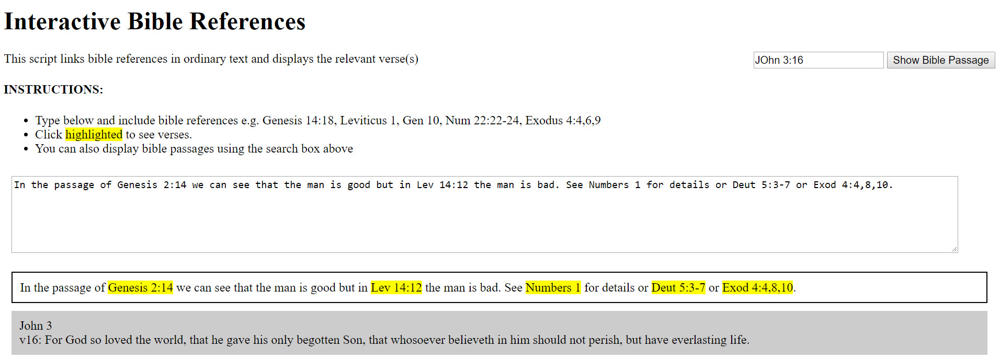

# interactivebible
This script links bible references in ordinary text and displays the relevant verse(s)

## Example:

(Plain Text)
In the passage of Genesis 2:14 we can see that the man is good but in Lev 14:12 the man is bad. See Numbers 1 for details or Deut 5:3-7 or Exod 4:4,8,10.

(Formatted Text)
In the passage of __*Genesis 2:14*__ we can see that the man is good but in __*Lev 14:12*__ the man is bad. See __*Numbers 1*__ for details or __*Deut 5:3-7*__ or __*Exod 4:4,8,10*__.

Note: formatted text will be highlighted in e.g. yellow

By clicking on a formatted reference the correct Bible translation and book will be loaded and the selected chapter and verse(s) displayed.

e.g.

John 3
v16: For God so loved the world, that he gave his only begotten Son, that whosoever believeth in him should not perish, but have everlasting life.

## Usage:
Either clone the files or extract the zip file and ensure the directories are the same. Open bible.html to see it in action and view the source to see the code. As this took a few days to write it could easily be modified into a class file and used in conjunction with jQuery to make things work more efficiently.

## Issues:
The RegEx is a little dicey when it comes to multiple books e.g. 1 John, 2 John etc. It sometimes picks the reference up correctly but not always. Any contributions to that would be welcome.

Also there is currently only King James Version (kjv) but Word English Bible (web) is available from bible-api.com too and when I get time I'll update the json files. More versions may be added but copyright becomes an issue with them.

## Final Notes:

Written in Javascript with json King James Version (KJV/Authorised Version) provided by http://bible-api.com and RegEx for extracting references provided by https://regex101.com/library/fS3wA0

I would appreciate any feedback or improvements - leehardingsoftware@gmail.com
